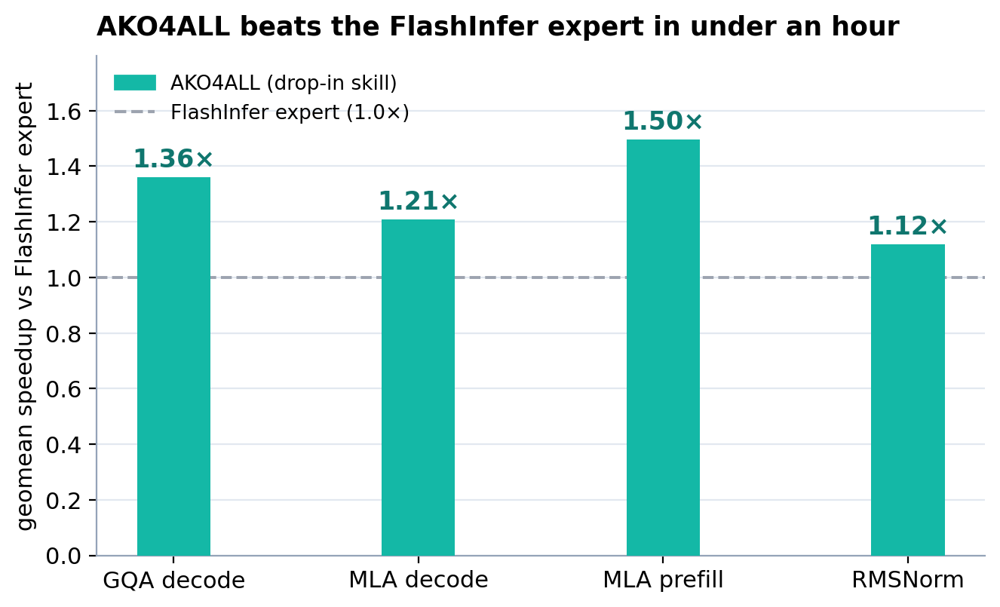

<h1 align="center">AKO4ALL</h1>
<p align="center"><b>Agentic Kernel Optimization for All</b></p>

<p align="center">
  <a href="https://tongminglaic.github.io/AKO"></a>
  <a href="https://github.com/TongmingLAIC/AKO4X"></a>
  <a href="https://tongminglaic.github.io/AKO/assets/ako-tech-report.pdf"></a>
</p>

<p align="center"><b>If you find our work useful, please consider giving us a star 🌟</b></p>

<p align="center">
  
  <br/>
  <i>Geomean speedup over the FlashInfer <b>expert</b> baseline (the strongest kernel FlashInfer ships) on NVIDIA B200 — every op clears the expert. Full table in <a href="#results">Results</a>.</i>
</p>

## News

- 📄 **[2026.05.31]** The **[AKO tech report](https://tongminglaic.github.io/AKO/assets/ako-tech-report.pdf)** is now available.
- 🚀 **[2026.05.31]** [**AKO4X**](https://github.com/TongmingLAIC/AKO4X) is now open-source — the closed-loop, campaign-based system behind our [MLSys 2026 competition](https://mlsys26.flashinfer.ai/) entry.
- ✨ **[2026.05.31]** **AKO4ALL** is now a single drop-in [Claude Code](https://docs.anthropic.com/en/docs/claude-code) skill — invoke it in any working directory.
- 🚀 **[2026.03.24]** AKO4ALL is released.

**Table of Contents**

- [What is AKO4ALL?](#what-is-ako4all)
- [What You Provide](#what-you-provide)
- [Install](#install)
- [How to Use](#how-to-use)
- [Requirements](#requirements)
- [How It Works](#how-it-works)
- [Results](#results)
- [Agent Behavior](#agent-behavior)
- [Permissions](#permissions)
- [Repo Layout](#repo-layout)
- [Example: SOL-ExecBench](#example-sol-execbench)
- [Anti-Cheat](#anti-cheat)
- [FAQ](#faq)
- [Tech Report](#tech-report)
- [Acknowledgments](#acknowledgments)

## What is AKO4ALL?

**AKO4ALL is automated GPU kernel optimization, packaged as a single [Claude Code](https://docs.anthropic.com/en/docs/claude-code) skill.** Drop a kernel into your working directory, invoke the skill, and the agent bootstraps a workspace in place and iteratively rewrites the kernel for maximum performance — profile, edit, benchmark, repeat, until the kernel stops getting faster. The skill is a single `SKILL.md` protocol document; other coding agents can drive the same loop by following it directly.

<p align="center">
  
</p>

**AKO4ALL vs [AKO4X](https://github.com/TongmingLAIC/AKO4X)** — two sibling projects with different framings.

- **Form:** AKO4ALL is a single Claude Code skill that runs in place in your working directory. AKO4X is a template repository that builds a fresh isolated child environment for each run.
- **Unit of work:** AKO4ALL is *one continuous optimization run on one kernel* — resumable across chat sessions, but with no memory carried into the next run on the same kernel. AKO4X is a *multi-round campaign on one operator* — a persistent master agent spawns rounds back-to-back, and a per-operator archive accumulates each round's results so the Nth round is informed by all earlier rounds.
- **Harness evolution:** AKO4ALL's protocol is static — you can supply behavior directives, but the skill itself does not change. AKO4X has an opt-in *harness co-evolution* mode in which the agent, after each round, can propose improvements to its own knowledge and tooling layer that the master gates and applies — no analogue here.

Reach for AKO4ALL when you just want a kernel optimized; reach for AKO4X when you want infrastructure around the optimization.

## What You Provide

A kernel and at least one set of test inputs are required. Everything else is optional.

- **Kernel** (required) — The kernel to optimize. Can be a single file or a directory. Supports Triton, CUDA, C++, TileLang, CuTe DSL, Python, or any language that can be benchmarked.
- **Reference implementation** (optional) — Used as the correctness golden. If absent, the original kernel is used.
- **Inputs** (at least one set required) — In any form: hardcoded inside the kernel/reference, defined in your benchmark script, a separate Python file with `get_inputs()`, or raw data files (`.npz`, `.bin`, shape lists, etc.) that the agent wires up itself. The agent assembles whatever is provided into something the bench script can call.
- **Benchmark script** (optional) — Your own benchmark script; the agent reads it to figure out how to run it. If no benchmark script is provided, the built-in [KernelBench](https://github.com/ScalingIntelligence/KernelBench) evaluator is used automatically (no setup needed beyond PyTorch).
- **Knowledge** (optional) — Reference materials for the agent: algorithm descriptions, papers, design docs, or any background knowledge that helps inform the optimization.
- **Hints** (optional) — Directives for the agent: optimization constraints, focus areas, and behavior controls (e.g., whether to allow web search).

## Install

Clone the repo directly into Claude Code's skills directory:

```bash
git clone https://github.com/TongmingLAIC/AKO4ALL.git ~/.claude/skills/ako4all
```

Or, if you already have it cloned somewhere else, symlink it:

```bash
ln -s /path/to/AKO4ALL ~/.claude/skills/ako4all
```

## How to Use

### Mode 1 — Interactive (default)

Open Claude Code in a directory containing your kernel, then ask it to optimize the kernel. Files in the working directory are inspected automatically; you can also point at external paths. Optional constraints — iteration cap, language preference, dependency policy, etc. — included in the prompt will be merged into `HINTS.md`.

The skill presents a resolved plan, asks if anything is genuinely ambiguous, and starts iterating. You can interrupt at any point to redirect.

<details>
<summary>Optional: pre-organize your workspace</summary>

If you want the conventional layout the skill recognizes:

```
<workspace>/
├── source/                      # Kernel + optional reference and inputs
│   ├── kernel.py
│   ├── reference.py             # Optional
│   └── inputs.py / data.npz ... # Optional — input data, any format
├── bench/                       # Your own benchmark script (optional)
│   └── ...
├── knowledge/                   # Reference materials (optional)
└── HINTS.md                     # Agent directives (optional)
```

These are conventions, not requirements. If your files are organized differently, just point Claude at them.

</details>

### Mode 2 — Batch via subagents (advanced)

For optimizing several related kernels in parallel, in Claude Code the main agent can spawn one subagent per kernel via the `Task` tool.

> ⚠️ **Subagents can't ask back.** In Claude Code, subagents lack `AskUserQuestion`. The main agent composes each subagent's prompt from your instructions plus what's in each kernel's directory; any decision you don't pin down there will fall to `SKILL.md` defaults. So include the things you care about (per-kernel paths, optional reference / inputs locations, language or iteration-cap constraints, custom branch names) — and let the rest default.

## Requirements

- A coding agent (e.g., [Claude Code](https://docs.anthropic.com/en/docs/claude-code))
- NVIDIA GPU with CUDA-enabled PyTorch (only for the built-in evaluator; a remote-execution bench script may not need either locally)
- Python **>= 3.10** for the built-in evaluator (or whatever your custom bench script requires)
- NVIDIA Nsight Compute (`ncu`) — recommended; its version must match your CUDA / PyTorch CUDA build. If unavailable, the loop still proceeds (no profiling — the agent reasons from runtime stats instead).
- Git

> **Note:** During the loop the agent may run `pip install` / `apt install` etc. to fill in missing dependencies. A container or virtual environment is recommended for isolation; to forbid installs, add a directive to `HINTS.md` (see [Agent Behavior](#agent-behavior)) or restrict via [Permissions](#permissions).

## How It Works

The agent creates an `opt/<kernel>` branch, copies your kernel to `solution/`, and generates `scripts/bench.sh` to wrap your benchmark. After verifying the baseline (and profiling it with `ncu` if available), it iterates: edit `solution/` → benchmark → log → commit. After 3 stagnant iterations it re-profiles, plans the next direction, and continues. Defaults like the stall threshold live in `HINTS.md`; iteration history lives in `ITERATIONS.md`. See [`SKILL.md`](SKILL.md) for the full protocol.

## Results

<details>
<summary><b>A drop-in skill that turns one prompt into an expert-beating kernel in under an hour — a clean sweep over FlashInfer's expert on all 4 inference ops.</b></summary>

<br>

Driven by **Claude Opus 4.8** (1M context, max thinking effort), on four FlashInfer-Bench inference operators AKO4ALL rewrote the reference into Triton kernels that **all beat FlashInfer's strongest _expert_ kernel** — geomean speedup over the FlashInfer expert on NVIDIA B200, all correctness-passing:

| Operator | Speedup vs FlashInfer expert | Workloads |
|---|---|---|
| GQA paged decode | **1.36×** | 48 |
| MLA paged decode | **1.21×** | 47 |
| MLA paged prefill | **1.50×** | 38 |
| RMSNorm h128 | **1.12×** | 14 |

*All four operators we ran are shown here — we time-boxed this round to four kernels, so these are not the best four cherry-picked from a larger sweep.*

**What one kernel takes to optimize** — a typical run, end-to-end from the initial prompt to the agent finishing:

| End-to-end | Input | Output | Cache read | Cache write |
|---|---|---|---|---|
| ~55 min | ~15k | ~253k | ~17.6M | ~752k |

A single drop-in skill — competitive-with-expert kernels in under an hour, from a single prompt.

</details>

## Agent Behavior

A few defaults worth knowing:

- **Language switching** — the agent may rewrite your kernel in a different language (e.g., Triton → CUDA) to chase performance.
- **Web search** — enabled; the agent searches for optimization ideas after consecutive stagnant iterations.
- **Profiling** — `ncu` runs on the baseline before iter-1 and again after 3 stagnant iterations.

To adjust any of this — or to add your own directives (optimization constraints, dependency policies, iteration caps, ...) — edit `HINTS.md` in your workspace. The file is self-documenting.

## Permissions

The optimization loop involves running shell commands (compiling, benchmarking, profiling). By default, most coding agents prompt for approval on each command. To run fully unattended, grant the necessary permissions through your agent's configuration.

For Claude Code, the simplest option is to bypass all permission checks:

```bash
claude --dangerously-skip-permissions
```

<details>
<summary>Granular control via settings file</summary>

Create `.claude/settings.local.json`:

```json
{
  "permissions": {
    "allow": [
      "Bash(*)", "Read(*)", "Write(*)", "Edit(*)",
      "Glob(*)", "Grep(*)", "Agent(*)",
      "WebFetch(*)", "WebSearch(*)"
    ]
  }
}
```

</details>

For other agents, consult their documentation on permission / auto-approve settings.

## Repo Layout

```
AKO4ALL/
├── SKILL.md              # Entry point — loaded by Claude Code when the skill triggers
├── HINTS.md              # Scaffold: agent behavior defaults
├── ITERATIONS.md         # Scaffold: iteration log template
├── bench-wrapper.sh      # Scaffold: bench script template
└── bench/kernelbench/    # Scaffold: built-in KernelBench evaluator
```

Scaffold files are copied into each workspace on first bootstrap, never overwriting existing files. `README.md`, `LICENSE`, and `assets/` are project metadata — not installed anywhere.

## Example: SOL-ExecBench

[SOL-ExecBench](https://github.com/NVIDIA/SOL-ExecBench) contains 235 real-world DL kernel problems from NVIDIA. AKO4ALL can optimize any of them by pointing at the problem directory directly — no copying into a local workspace.

1. Install the skill (see [Install](#install)) and clone SOL-ExecBench separately. Set up its environment and `ncu` per its own instructions.

2. Activate the SOL-ExecBench environment and open Claude Code in any working directory:

   ```bash
   claude
   ```

3. Give it a prompt (replace the paths and iteration cap):

   ```
   Optimize the kernel at <sol-bench>/data/benchmark/L1/001_attention_softmax_dropout_value_matmul_backward.
   Bench with SOL-ExecBench at <sol-bench>; its dependencies are already installed.
   Optimize for up to 30 iterations. Stop early only if all viable approaches are exhausted.
   ```

The skill resolves the external path, wraps SOL-ExecBench's bench command as `scripts/bench.sh`, and starts iterating.

## Anti-Cheat

Three layers of protection against the agent gaming the metric instead of achieving real speedup:

1. **Agent rules.** The skill instructs the agent to pursue genuine latency reduction — no CUDA stream injection, no timing manipulation, no returning uninitialized results. Full list in [`SKILL.md`](SKILL.md) "Gotchas".

2. **Evaluator checks** (built-in KernelBench). Flags suspicious >10× speedups for review, and strips any input-generating code (e.g., `get_inputs`) from the solution file before evaluation — so the solution can't choose what it's tested against.

3. **Stricter enforcement** (optional). Provide a custom bench script with static analysis — e.g., KernelBench's [`kernel_static_checker.py`](https://github.com/ScalingIntelligence/KernelBench) — to reject solutions that contain disallowed patterns before they are even timed.

## FAQ

**1. Can I use AKO4ALL for a whole benchmark suite?**
For ad-hoc optimization of several kernels at once, see [Mode 2](#mode-2--batch-via-subagents-advanced). For campaign-grade multi-round optimization — cross-run memory, an archive of variants feeding the next round, and master/sub agent separation — see [AKO4X](https://github.com/TongmingLAIC/AKO4X) (default benchmark: flashinfer-bench, swappable via adapter).

**2. My agent isn't trying hard enough — keeps tuning configs instead of rewriting.**
Agent laziness is a known failure mode (staying in PyTorch, only tuning configurations, skipping profiling). Intervene with specific guidance, or add directives to `HINTS.md` ahead of time. The point of the loop is to *rewrite* the kernel — switch languages (Triton → CUDA, etc.) when it helps.

**3. Which model should I use?**
Model capability strongly influences optimization quality. We recommend [Claude Opus](https://docs.anthropic.com/en/docs/about-claude/models).

**4. How do I cap iterations?**
By default there is no cap — the agent decides when to stop on its own. To enforce a limit, add a directive to `HINTS.md`, or include it in your prompt (e.g., `Optimize for up to 30 iterations. Stop early only if all viable approaches are exhausted.`).

**5. My bench script uses a remote service (e.g., Modal). Does that work?**
Yes. As long as your bench script runs from the command line and prints results to stdout. The local machine doesn't need a GPU / CUDA / PyTorch in that case — just whatever your wrapper script imports.

**6. Can I intervene during optimization?**
Yes. Interrupt to redirect, or to manually edit files in `solution/` — then tell the agent to continue.

## Tech Report

The **[AKO tech report](https://tongminglaic.github.io/AKO/assets/ako-tech-report.pdf)** is now available.

## Citation

If you find AKO useful, please cite:

```bibtex
@misc{ako2026,
  title        = {{AKO}: Agentic Kernel Optimization},
  author       = {Shuxiao Xie and Shuyang Xie and Dezhi Ran and Wei Yang and Tao Xie},
  year         = {2026},
  howpublished = {\url{https://tongminglaic.github.io/AKO}},
  note         = {Technical report}
}
```

## Acknowledgments

We would like to thank the following open-source projects that inspired and supported the development of AKO:

- [KernelBench](https://github.com/ScalingIntelligence/KernelBench) — for providing the benchmark and evaluation format used by AKO4ALL's built-in evaluator.
- [autoresearch](https://github.com/karpathy/autoresearch) and [autokernel](https://github.com/RightNow-AI/autokernel) — AKO's design was inspired by their work on autonomous optimization loops.
